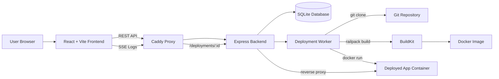

# Velox

A learning-focused deployment platform implementation that explores containerized deployments, runtime detection, reverse proxying, and deployment orchestration.

Velox accepts a Git repository URL, clones the project, automatically detects its runtime using Railpack, builds it with BuildKit, starts the resulting Docker image, stores deployment state in SQLite, streams build logs in real-time over Server-Sent Events, and exposes running applications through a backend reverse proxy.

## Project Scope

Velox is designed as an **educational infrastructure project**, inspired by platforms like Vercel, Render, and Railway. It prioritizes understanding deployment internals rather than providing universal runtime support.

The project explores:

- Containerized deployments and image orchestration
- Automatic runtime detection using Railpack
- Reverse proxying with Caddy
- Dynamic container lifecycle management
- Server-Sent Events (SSE) for real-time log streaming
- Deployment state management with SQLite

The platform intentionally evolves incrementally. Runtime support is currently selective and not universal, reflecting the reality that not all Git repositories are directly deployable web services.

## Tech Stack

- Frontend: React, TypeScript, Vite, TanStack Query
- Backend: Node.js, Express, TypeScript
- Storage: SQLite via `better-sqlite3`
- Build/runtime: Docker, BuildKit, Railpack
- Proxy: Caddy and `http-proxy-middleware`

## Current Deployment Support

The platform currently works best with backend HTTP services that follow conventional runtime patterns. These workloads are tested and expected to deploy successfully:

### Stable / Recommended

Velox has the most reliable support for:

- Node.js backend services (any HTTP framework)
- Express applications
- Fastify servers
- Hono services
- Conventional Go backend services exposing a `PORT` environment variable

These deployments work well because:

- They follow predictable runtime conventions
- Startup commands are easily inferred through dependency analysis
- They expose HTTP services directly without complex routing
- Railpack's automatic detection handles their build requirements reliably

**Example:** A standard Express app with a `package.json` will clone, build, start, and serve requests with minimal friction.

### Experimental / Partial Support

Frontend and full-stack deployments are currently experimental. They may build successfully but can encounter runtime issues:

Frontend frameworks:

- React/Vite applications
- Next.js applications
- Static frontend deployments

**Known Issues:**

- Asset routing problems (CSS, JavaScript, images may fail to load)
- Base path mismatches when served behind reverse proxy at `/deployments/:id`
- Single-page application (SPA) routing conflicts with proxy path rewriting
- Environment variables interpolated at build time rather than runtime
- Hot Module Replacement (HMR) incompatible with reverse proxy setup
- Static file serving may fail if build output structure doesn't match assumptions

**Why this happens:**

- Frontend deployments require careful static asset handling, which the current reverse proxy doesn't fully support
- Frontend frameworks often assume serving from a predictable domain root (`/`), not from a subpath like `/deployments/:id`
- Build-time environment variables cannot be changed after deployment

A frontend build may complete successfully but still fail to display correctly at runtime. Frontend support is actively evolving, but production use of frontend deployments is not recommended at this time.

### Not Reliably Supported Yet

The platform does not currently support:

- Rust services (requires Rust toolchain, not automatically installed)
- Python applications (requires Python environment and pip configuration)
- Java applications (requires JVM and build tools)
- Monorepos and workspaces (complex dependency resolution)
- SDK or tooling repositories (not standalone HTTP services)
- Multi-service architectures (requires container orchestration)
- Applications requiring custom runtime or explicit startup commands
- Databases or external service dependencies

**Why these aren't supported:**

- Not all Git repositories are deployable web applications
- Some ecosystems require explicit configuration or runtime setup
- Railpack's automatic detection works best for isolated, self-contained services
- Complex deployment scenarios require manual configuration beyond the platform's scope

If you attempt to deploy a repository that falls into these categories, the build may fail or the application may not start. Check the deployment logs for specific error details.

## Architecture



## Project Structure

```text
.
├── backend
│   ├── src
│   │   ├── db
│   │   ├── routes
│   │   ├── services
│   │   └── workers
│   ├── caddy/Caddyfile
│   └── Dockerfile
├── frontend
│   └── src
└── docker-compose.yml
```

## How It Works

1. The frontend sends a repository URL to `POST /deployments`.
2. The backend creates a deployment record in SQLite with a unique ID.
3. A worker process clones the repository into `backend/tmp/<deployment-id>`.
4. Railpack analyzes the cloned project to detect its runtime and framework.
5. Railpack generates a Dockerfile and BuildKit builds the image.
6. Docker starts the built image on a random ephemeral port (4000-4999).
7. Logs are streamed to the client in real-time via Server-Sent Events.
8. The running deployment is accessible at `/deployments/:id` through the reverse proxy.
9. Deployments automatically expire and are cleaned up after 7 days.

## Technical Notes

### Runtime Detection and Limitations

The platform relies on **Railpack** for automatic runtime detection. This works by:

- Analyzing `package.json`, `go.mod`, `requirements.txt`, and other dependency files
- Inferring the correct runtime environment and startup command
- Generating a Dockerfile without manual configuration

**Runtime detection works best with:**

- Standard project structures following language conventions
- Single-service applications with clear entry points
- Projects that don't require environment-specific configuration

**Runtime detection has limitations:**

- Non-standard project layouts may confuse the detection algorithm
- Complex build steps or preprocessing steps may not be captured
- Projects requiring external services (databases, caches, APIs) won't work without manual intervention
- Monorepos and SDK repositories are not properly handled
- Some frameworks require explicit configuration beyond what Railpack can infer

### Build Success vs. Runtime Success

A critical distinction in Velox:

**Successful Docker image build does not guarantee successful runtime execution.**

A build can succeed (image is created) but the application may still fail to:

- Start without errors
- Listen on the expected PORT
- Serve HTTP requests correctly
- Load configuration or connect to external services

Always check the **deployment logs** for detailed error information. Successful builds that fail at runtime will show error messages in the logs before marking the deployment as failed.

### Frontend Deployments

Frontend frameworks are significantly different from backend services:

- **Backend:** Stateless HTTP server listening on PORT, handling requests directly
- **Frontend:** Static files that must be served with correct MIME types and routing rules

The current proxy setup (`http-proxy-middleware`) works well for forwarding requests but does not handle:

- SPA routing (redirecting 404s to `index.html`)
- CSS/JS/image asset base paths when served from a subpath
- Cache busting and versioned assets
- Graceful error pages

These limitations mean frontend deployments often fail at runtime even if the build succeeds.

### Deployment Lifecycle

Each deployment:

1. **Pending**: Queued and waiting to start
2. **Building**: Cloning repository and building image with Railpack/BuildKit
3. **Deploying**: Starting container and waiting for HTTP server to be ready
4. **Running**: Application is serving requests at `/deployments/:id`
5. **Failed**: Build or runtime error occurred; check logs for details

Failed deployments remain in the database for 7 days, then are automatically cleaned up.

### Port Allocation and Container Networking

- Each deployment gets a random ephemeral port (4000-4999)
- Containers run with port mapping: `-p <random>:3000`
- All deployed apps are expected to listen on port 3000 inside the container
- The `DEPLOYMENT_HOST` environment variable determines how to reach containers (defaults to `host.docker.internal` in Docker)

## Known Limitations

- **No custom startup commands**: Applications must follow Railpack's inferred startup behavior
- **No environment variable configuration**: Build-time variables cannot be overridden after deployment
- **No persistent storage**: Each deployment is ephemeral; no volumes or databases persist data
- **Single-port model**: Applications must expose HTTP on a single port (typically 3000)
- **No SSL per deployment**: All deployments are accessed through the single Caddy proxy
- **No autoscaling**: Each deployment runs a single container instance
- **Limited monorepo support**: Multi-package workspaces are not reliably handled
- **Frontend proxy limitations**: SPAs and complex routing patterns don't work well

## Future Improvements

Possible enhancements to the platform:

- Smarter runtime detection for edge cases and complex projects
- Environment variable configuration at deployment time
- Custom startup command support for applications with non-standard requirements
- Improved frontend/static asset serving with SPA routing
- Deployment subdomain routing (e.g., `<deployment-id>.deployments.local`)
- Better monorepo and workspace handling
- Persistent volume support for databases and caches
- Deployment logs retention and archival beyond 7 days
- Performance monitoring and error tracking
- Webhook support for CI/CD integration

## Local Development

### Backend Setup

Start the Docker Compose stack (database, reverse proxy, BuildKit, Express backend):

```bash
docker compose up --build
```

The backend will run on `http://localhost:3001` and be accessible through Caddy at `http://localhost:8080/deployments`.

### Frontend Setup

In a separate terminal, start the React development server:

```bash
cd frontend
npm install
npm run dev
```

The frontend will open at `http://localhost:5173` and proxy API requests to `http://localhost:8080` by default.

To override the API base URL:

```bash
VITE_API_BASE_URL=http://localhost:8080 npm run dev
```

### Testing Deployments Locally

When testing the platform, use repositories that are known to work with Railpack:

**Good test repositories:**

- Node.js with Express/Fastify/Hono
- Simple Go HTTP services with `go.mod`

**Avoid testing with:**

- Frontend-only repositories (experimental, likely to fail)
- Monorepos or multi-package workspaces (not supported)
- Repositories requiring environment variables or external services

To test a deployment:

1. Open `http://localhost:5173`
2. Paste a Git repository URL (e.g., a public Express example)
3. Watch the logs stream in real-time as the build progresses
4. Once deployed, click "Live" to view the running application
5. Check logs if the build or runtime fails

### Code Validation

Frontend production build:

```bash
cd frontend
npm run build
```

Backend type check:

```bash
cd backend
npx tsc --noEmit
```

## Deployment to a Server

### Prerequisites

Velox requires direct Docker and BuildKit access, making it unsuitable for serverless platforms. Deploy it to infrastructure you control:

**Suitable deployment targets:**

- Ubuntu VPS or VM
- Dedicated server with Docker support
- Private cloud environment (not serverless)
- Any Linux machine where you can install Docker and Docker Compose

**Not suitable for:**

- Vercel, Netlify (serverless, no Docker access)
- AWS Lambda, Google Cloud Functions (serverless)
- Shared hosting or cPanel-based hosting
- Platforms without Docker support

### Deployment Steps

1. **Provision infrastructure:**
   - Ubuntu 22.04+ VPS or VM
   - 2+ GB RAM, 20+ GB disk space
   - Root or sudoer access

2. **Install Docker and Compose:**
   ```bash
   curl -fsSL https://get.docker.com -o get-docker.sh
   sudo sh get-docker.sh
   sudo usermod -aG docker $USER
   sudo apt install docker-compose-plugin
   ```

3. **Clone the repository:**
   ```bash
   git clone https://github.com/your-org/velox.git
   cd velox
   ```

4. **Configure the frontend API URL:**
   
   Update `frontend/.env.production` or set `VITE_API_BASE_URL` during build:
   ```bash
   VITE_API_BASE_URL=https://your-api-domain.com npm run build
   ```

5. **Update Caddy configuration:**
   
   Edit `backend/caddy/Caddyfile` to use your actual domain:
   ```
   your-api-domain.com {
     handle /deployments {
       reverse_proxy backend:3001
     }
     handle /deployments/* {
       reverse_proxy backend:3001
     }
   }
   ```

6. **Start the backend stack:**
   ```bash
   docker compose up -d --build
   ```

7. **Deploy the frontend:**
   
   Option A: Serve from the same VPS
   ```bash
   # Serve static build files with a simple HTTP server
   cd frontend
   npm run build
   npx serve -s dist -l 3000
   ```
   
   Option B: Deploy to a CDN or static hosting (Vercel, Netlify, etc.)
   - Build locally: `npm run build`
   - Deploy the `dist/` folder to your hosting provider

8. **Verify the deployment:**
   ```bash
   # Check the API is responding
   curl https://your-api-domain.com/deployments
   
   # Open the frontend in your browser
   # Test by deploying a simple Node.js or Go application
   ```

### Important Considerations

- **Storage:** Deployments and logs are stored in `database.db` in the backend container. Use Docker volumes for persistence if restarting containers.
- **Cleanup:** Deployments are automatically deleted after 7 days. Logs are removed with their deployments.
- **Security:** The platform accepts arbitrary Git URLs. Restrict access or run in a sandboxed environment.
- **Resource limits:** Each deployment runs in a separate container. Monitor disk usage as built images accumulate.


## Current API

Create a deployment:

```http
POST /deployments
Content-Type: application/json

{
  "repoUrl": "https://github.com/user/project.git"
}
```

List deployments:

```http
GET /deployments
```

Stream logs:

```http
GET /deployments/:id/logs
```

Open a running deployment:

```http
GET /deployments/:id
```
